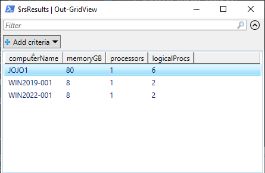

# Runspaces
Runspaces are a way to perform fast parallel processing with powershell.

## runspace_demo.ps1
In this demo we create a runspace pool. Each runspace takes an input parameter that identifies the itereation count. The powershell for each runspace generates a random number of seconds to wait before completion. This simulates threads completing at different times.

Example Output:
```
Passed Iteration Value: 1 | Random Wait(Sec): 2 | Date: 02/25/2024 17:14:18
Passed Iteration Value: 3 | Random Wait(Sec): 2 | Date: 02/25/2024 17:14:18
Passed Iteration Value: 2 | Random Wait(Sec): 3 | Date: 02/25/2024 17:14:19
Passed Iteration Value: 4 | Random Wait(Sec): 3 | Date: 02/25/2024 17:14:19
Passed Iteration Value: 7 | Random Wait(Sec): 1 | Date: 02/25/2024 17:14:19
Passed Iteration Value: 5 | Random Wait(Sec): 4 | Date: 02/25/2024 17:14:20
Passed Iteration Value: 8 | Random Wait(Sec): 1 | Date: 02/25/2024 17:14:20
Passed Iteration Value: 9 | Random Wait(Sec): 1 | Date: 02/25/2024 17:14:20
Passed Iteration Value: 6 | Random Wait(Sec): 3 | Date: 02/25/2024 17:14:21
Passed Iteration Value: 10 | Random Wait(Sec): 2 | Date: 02/25/2024 17:14:21
Passed Iteration Value: 12 | Random Wait(Sec): 1 | Date: 02/25/2024 17:14:21
Passed Iteration Value: 13 | Random Wait(Sec): 1 | Date: 02/25/2024 17:14:21
Passed Iteration Value: 11 | Random Wait(Sec): 2 | Date: 02/25/2024 17:14:22
Passed Iteration Value: 14 | Random Wait(Sec): 1 | Date: 02/25/2024 17:14:22
Passed Iteration Value: 16 | Random Wait(Sec): 1 | Date: 02/25/2024 17:14:22
Passed Iteration Value: 18 | Random Wait(Sec): 1 | Date: 02/25/2024 17:14:23
Passed Iteration Value: 20 | Random Wait(Sec): 1 | Date: 02/25/2024 17:14:23
Passed Iteration Value: 15 | Random Wait(Sec): 3 | Date: 02/25/2024 17:14:24
Passed Iteration Value: 17 | Random Wait(Sec): 3 | Date: 02/25/2024 17:14:24
Passed Iteration Value: 19 | Random Wait(Sec): 4 | Date: 02/25/2024 17:14:26
```

## runspace_demo_remote.ps1
This runspace demo creates a runspace pool for each target windows system. As threads in the pool becom available, a remote connection is made and system information is retrieved from the target. The result of each connection is a custom object. Each resulting object is placed into an array. The array of objects works well with a Gridview or exporting to json.

### Gridview Output
The gridview can be used for basic data analysis with sorting and filtering.


### JSON Output
The json output can be helpful for further programatic requirements such as reconciling a CMDB or capacity planning.
```
[
    {
        "computerName":  "JOJO1",
        "memoryGB":  80,
        "processors":  1,
        "logicalProcs":  6
    },
    {
        "computerName":  "WIN2022-001",
        "memoryGB":  8,
        "processors":  1,
        "logicalProcs":  2
    },
    {
        "computerName":  "WIN2019-001",
        "memoryGB":  8,
        "processors":  1,
        "logicalProcs":  2
    }
]
```